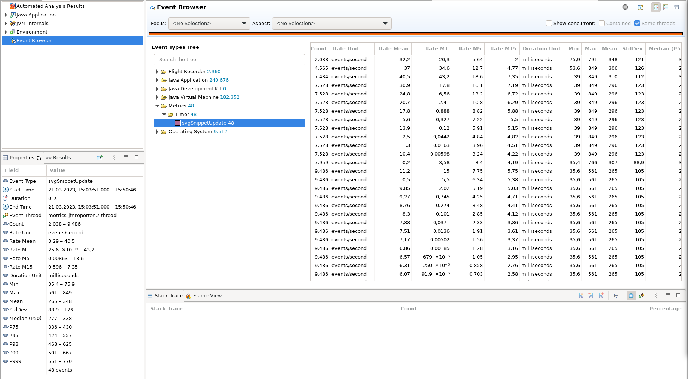

Metrics JFR
===========

A reportor for [Dropwizard Metrics](https://metrics.dropwizard.io) that
publishes reports as Java Flight Recorder (JFR) Events.

Example
-------

This is a screenshot of a Timer metric viewed in Java Mission Control:

Deficiencies
------------

Unfortunately JFR doesn't allow specifying the order of fields to display.
And Java Mission Control by default sorts the fields alphabetically.

It seems there is not even a way configure the display of certain JFR Events (like hiding and reordering columns). Therefore this must be done manually everytime a JFR dump is analyzed…
